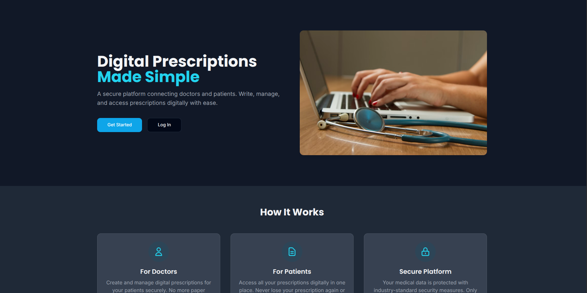
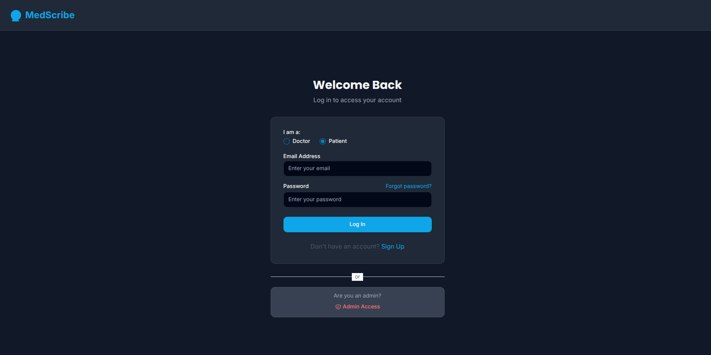
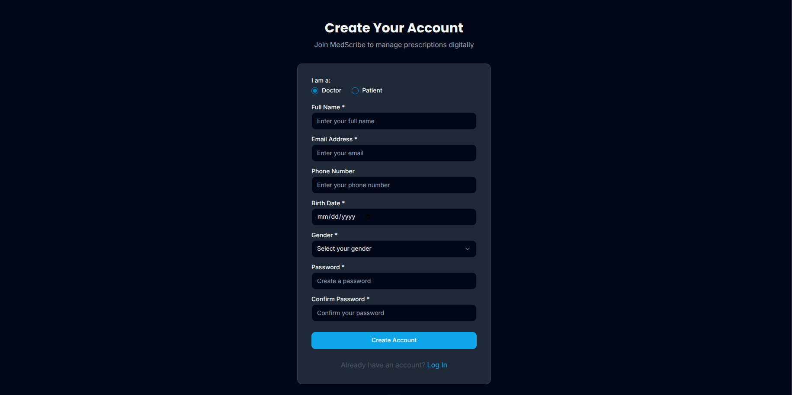
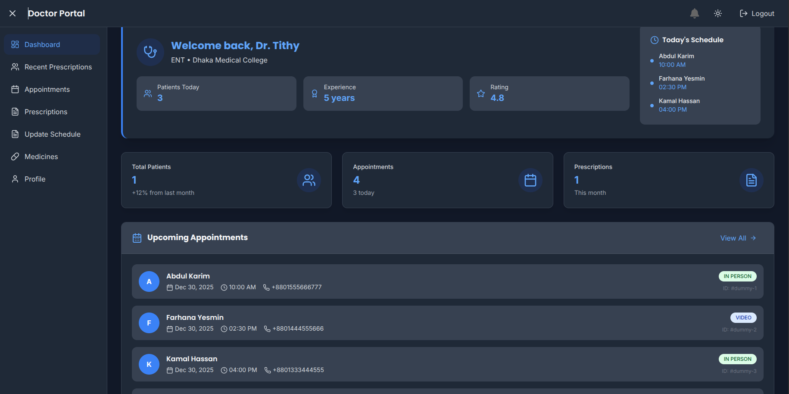
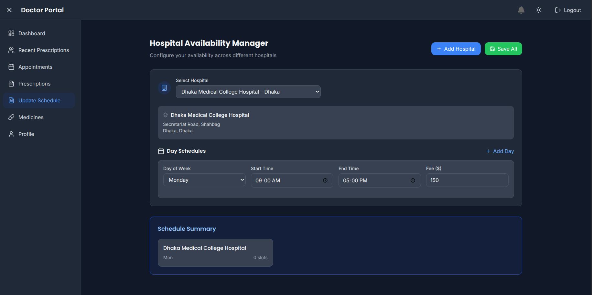
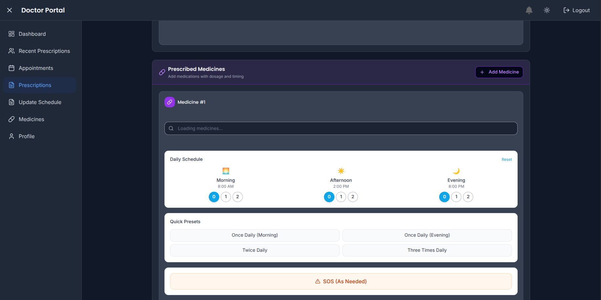
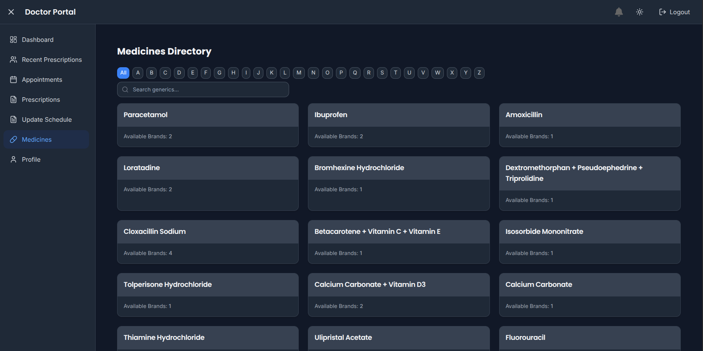
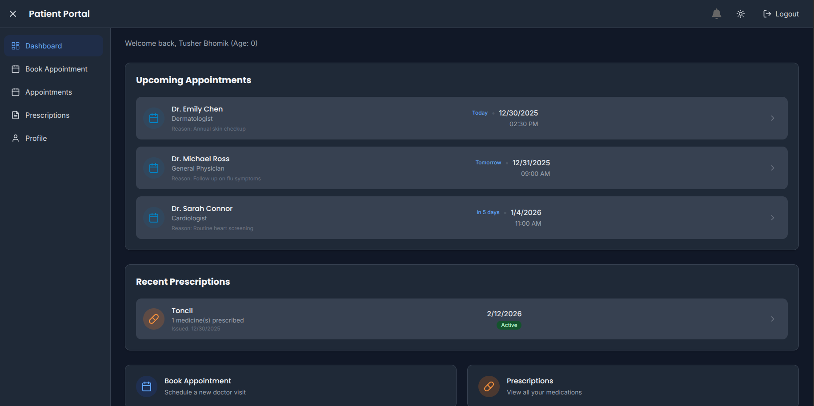
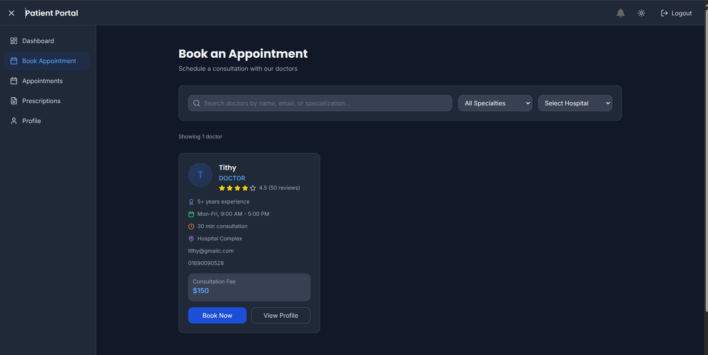
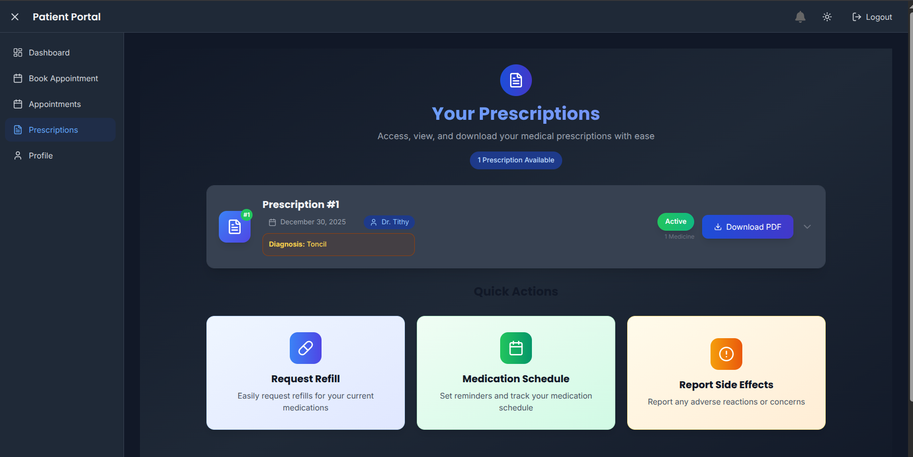

# 🏥 HealthSync - Medical Appointment & Management System

> A comprehensive full-stack healthcare platform connecting patients and doctors with real-time scheduling, prescription management, and secure medical records.


## 📸 App Walkthrough (Scroll Right ➡️)

<table>
  <tr>
    <td align="center" style="min-width: 200px;">
      <a href="Image/starter_page.png">
        
      </a><br />
      <sub><b>Landing Page</b></sub>
    </td>
    <td align="center" style="min-width: 200px;">
      <a href="Image/login.png">
        
      </a><br />
      <sub><b>Secure Login</b></sub>
    </td>
    <td align="center" style="min-width: 200px;">
      <a href="Image/signup.png">
        
      </a><br />
      <sub><b>Registration</b></sub>
    </td>
    <td align="center" style="min-width: 200px;">
      <a href="Image/doctor_dashboard.png">
        
      </a><br />
      <sub><b>Doctor Dashboard</b></sub>
    </td>
    <td align="center" style="min-width: 200px;">
      <a href="Image/update_schedule_of_doctor.png">
        
      </a><br />
      <sub><b>Schedule Management</b></sub>
    </td>
    <td align="center" style="min-width: 200px;">
      <a href="Image/doctor_precription.png">
        
      </a><br />
      <sub><b>Write Prescription</b></sub>
    </td>
    <td align="center" style="min-width: 200px;">
      <a href="Image/all_medicines-generics.png">
        
      </a><br />
      <sub><b>Medicine Database</b></sub>
    </td>
    <td align="center" style="min-width: 200px;">
      <a href="Image/patient_dashboard.png">
        
      </a><br />
      <sub><b>Patient Dashboard</b></sub>
    </td>
    <td align="center" style="min-width: 200px;">
      <a href="Image/patient_book_appointment.png">
        
      </a><br />
      <sub><b>Book Appointment</b></sub>
    </td>
    <td align="center" style="min-width: 200px;">
      <a href="Image/Patient-all_prescriptions.png">
        
      </a><br />
      <sub><b>Medical History</b></sub>
    </td>
  </tr>
</table>

---

## 🛠️ Tech Stack

### **Frontend**
* **Framework:** React.js (Vite)
* **Styling:** Tailwind CSS, Shadcn UI
* **Icons:** Lucide React
* **State Management:** React Hooks (Context API)
* **HTTP Client:** Fetch API

### **Backend**
* **Framework:** Spring Boot (Java)
* **Security:** Spring Security + JWT (JSON Web Tokens)
* **Database:** PostgreSQL (Serverless via **Neon DB**)
* **ORM:** Spring Data JPA (Hibernate)
* **Storage/Auth:** Firebase Integration

---

## ✨ Key Features

### 👨‍⚕️ For Doctors
* **Dashboard Analytics:** View total patients, appointment stats, and daily schedules.
* **Schedule Management:** Update availability and slots.
* **Prescription System:** Create digital prescriptions with generic medicine database.
* **Patient History:** Access recent patients and their medical records.
* **Profile Management:** Manage professional details and qualifications.

### 👤 For Patients
* **Personal Health Dashboard:** Track appointments and recent prescriptions.
* **Appointment Booking:** Easy interface to find doctors by specialization.
* **Medical History:** View all past prescriptions.
* **Profile:** Manage personal health metrics like height, weight, and blood type.

---

## 🚀 Getting Started

Follow these instructions to set up the project locally.

### Prerequisites
* Java JDK 17+
* Node.js & npm
* Maven
* A Neon DB account (PostgreSQL)
* A Firebase project

### 1. Database Setup (Neon DB)
1.  Create a project in [Neon Console](https://console.neon.tech).
2.  Copy your PostgreSQL connection string.
3.  Ensure your `application.properties` allows Hibernate to generate the schema:
    ```properties
    spring.jpa.hibernate.ddl-auto=update
    ```

### 2. Backend Setup (Spring Boot)
1.  Navigate to the backend directory:
    ```bash
    cd backend
    ```
2.  Configure environment variables in `src/main/resources/application.properties`:
    ```properties
    spring.datasource.url=jdbc:postgresql://ep-your-neon-host.aws.neon.tech/neondb
    spring.datasource.username=your_user
    spring.datasource.password=your_password
    
    # JWT Configuration
    app.jwt.secret=your_very_long_secret_key_here
    app.jwt.expiration=86400000
    
    # Firebase
    app.firebase.config.path=classpath:firebase-config.json
    ```
3.  Run the application:
    ```bash
    mvn spring-boot:run
    ```

### 3. Frontend Setup (React)
1.  Navigate to the frontend directory:
    ```bash
    cd frontend
    ```
2.  Install dependencies:
    ```bash
    npm install
    ```
3.  Create a `.env` file in the root of the frontend folder:
    ```env
    VITE_API_BASE_URL=http://localhost:8080/api
    ```
4.  Run the development server:
    ```bash
    npm run dev
    ```

---

## 📂 Project Structure

```bash
├── backend/                 # Spring Boot Application
│   ├── src/main/java/
│   └── pom.xml
│
├── frontend/                # React Application
│   ├── src/
│   │   ├── components/
│   │   ├── pages/
│   │   └── lib/
│   └── package.json
│
└── Image/                   # Project Screenshots
    ├── starter_page.png
    ├── login.png
    ├── doctor_dashboard.png
    └── ...
